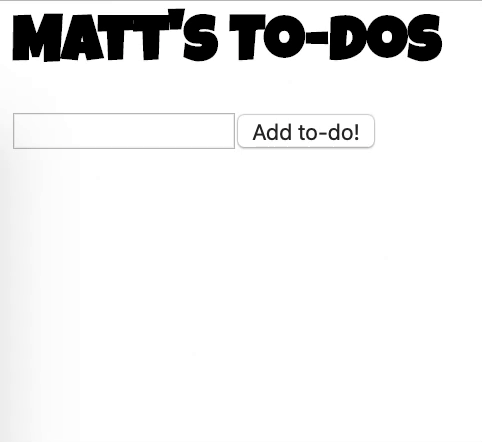
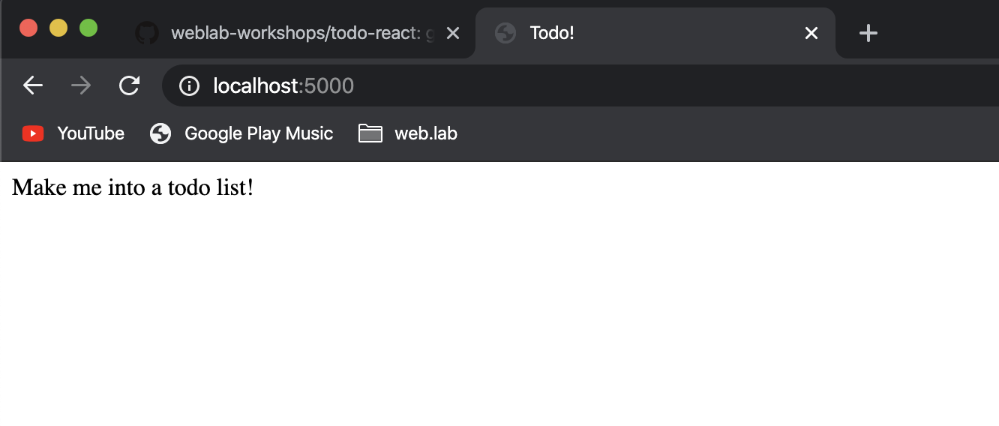
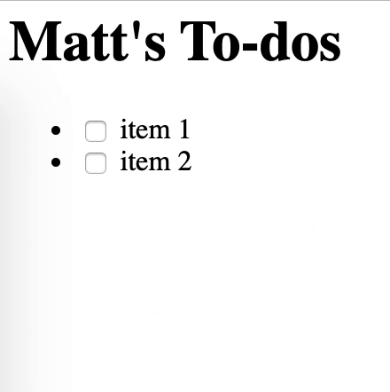
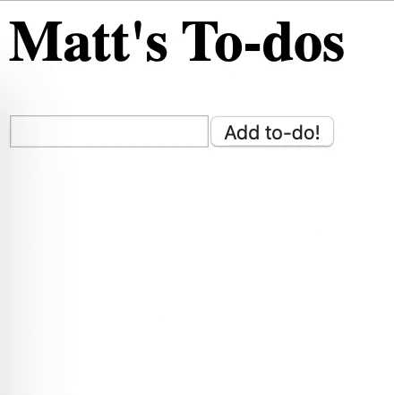

# todo-react

Get more familiar with react by making a todo list!

Here is the finished product we are aiming for:  


This README contains both step-by-step instructions and hints. Solutions will be in separate files, also linked in this document. At first, we recommend you scroll only far enough to see the instructions, and try to do what we ask on your own. Even for things like cloning the repository! Try to see if you remember the git commands before directly copying the commands.

Still, if you get stuck, feel free to refer back to this README, scrolling a bit more to see the hints. After trying your best, go ahead and compare to the linked solution.

We don't have branches for every step, so just try your best to follow along. There is a branch with staff solutions, so when you get through this README, we'll have you checkout to there and see what we did.

## STEP 0: Clone the repository

Get this repository (repo, for short) from GitHub onto your own computer. Remember, this is done with the terminal, and involves _cloning_ the repo into your desired folder.

Try this on your own! See below for the commands to run, if you get stuck.

Note: DO NOT clone this repository inside of catbook-react. Make sure you're in some other directory like your home directory (~) or Desktop or Documents.

<br/>
<br/>
<br/>
<br/>
<br/>
<br/>
<br/>
<br/>
<br/>

#### Solution

[Step 0 solution](solutions/step0.md)

## Step 1: Run the hotloader

Once you have the repo cloned, the next step will be run the hotloader, so that we can make changes to code and see them in our browser. The end goal of this step is to see the following in our browser. Try to get here on your own first.



<br/>
<br/>
<br/>
<br/>
<br/>
<br/>
<br/>
<br/>
<br/>

#### Solution

[Step 1 solution](solutions/step1.md)

## Step 2: Hardcode a to-do list

Now we can finally start writing some React code (which, if you remember, just boils down to JavaScript!). The first step will be to write a React component that represents a to-do item. You can hardcode the to-do's content for now. The hard part of this step (and the thing that React should make easier!) is that we want you to write **one** React component, but then use it multiple times, with different content each time! Recall that, every time we make a React component, we need to `export` it from the file we make it in, and `import` it in the file we'd like to use it in. See Workshop 1 or 2 for the specific syntax here.



\*Some styling is used to achieve the above, but we won't have it in the solutions^

Hmm, how can we accomplish that? Try to match the picture. At this step, remember that the internet is your friend, and the best resource out there. For something like "how do I even make a checkbox?", google it!

<br/>
<br/>
<br/>
<br/>
<br/>
<br/>
<br/>
<br/>
<br/>

#### Hint

Like we said, we want a component to represent a to-do item. Let's call it something like `ListItem`. We want to be able to do something like

```html
<ul>
  <ListItem ??? />
  <ListItem ??? />
</ul>
```

but have every list item render different text. We accomplish this with `props`! If we make a React component's `return` function depend on the `props` of that component, we can make two `ListItem`'s look different, but have exactly the same code.

<br/>
<br/>
<br/>
<br/>
<br/>
<br/>
<br/>
<br/>
<br/>

#### Solution

[Step 2 solution](solutions/step2.md)

## Step 2.5: Track the state of the checkbox

This step is not strictly necessary, but teaches a lot about interacting with elements when using React, and will help with Step 3.

In the last step, we added a checkbox input. Inputs are really cool HTML elements, but they're kind of special in that they have some inherent "state" to them (a more abstract notion of state, not referring to React's specific version of `state`). In the case of a checkbox, it can either be "checked" or not. We don't have to worry about keeping track of this, because the HTML element does it on its own.

But what if we wanted to know whether the checkbox was checked or not at some point? There's probably some obscure method we could use to do this, but React has a suggested approach, in what is known as **Controlled Components**.

First, read more about them [here](https://reactjs.org/docs/forms.html). The general idea is that we actually take over the state management of the checkbox (or any input, for that matter). We do this because it gives us an easy way to know the state of an input at any time, since it'll be in our `state`.

For this step, try to make the checkbox input you used a Controlled Component. In other words, declare some state for `ListItem` that determines whether the checkbox is checked or not, and that changes when the checkbox is pressed.

<br/>
<br/>
<br/>
<br/>
<br/>
<br/>
<br/>
<br/>
<br/>

#### Solution

[Step 2.5 solution](solutions/step2_5.md)

## Step 3: Make to-dos based on user input

The first time we build a React component, it's always helpful to pass in some hardcoded `props`, so that we know the component works as expected. The natural next step is to get rid of the hardcoding, and use dynamic data. Let's try to do that with our to-do list, and make to-do items based on user input.



As a starting point, think about how you might represent a to-do item in `state`. Remember, google should be your first go-to when getting stuck.

<br/>
<br/>
<br/>
<br/>
<br/>
<br/>
<br/>
<br/>
<br/>

#### Hint

We need someplace to keep track of all these to-dos, and we need to keep track of the user's input. Let's put that in `state`. But `state` for which component? Well, the parent component `TodoList` is responsible for passing down content as `props` to `TodoItem`, and it has our text input as well, so let's put it there.

Your `TodoList` should begin by initializing state for the todos array and inputText, like this:

```javascript
const [todos, setTodos] = useState([]);
const [inputText, setInputText] = useState("");
```

We have an array for keeping track of our list of to-dos, and a string for tracking user input. Looks good!

Next, make a button. When you hit it, you should get a new to-do that shows up.

<br/>
<br/>
<br/>
<br/>
<br/>
<br/>
<br/>
<br/>
<br/>

#### Solution

[Step 3 solution](solutions/step3.md)

## Step 4: Delete to-dos?

If you got this far, nice work! This is probably all you really need to know to be considered "caught up". The next two steps are really just challenge/fun.

First, can you add the ability to delete to-dos?


<br/>
<br/>
<br/>
<br/>
<br/>
<br/>
<br/>
<br/>
<br/>

#### Hint

To be able to delete, we need to be able to identify which to-do item the user clicked on. Consider changing your `submitTodo` function first. When submitting a to-do, instead of just storing the text, it might be helpful to store a JavaScript object that contains the text and a unique ID number. You can choose how to generate that ID number.

<br/>
<br/>
<br/>
<br/>
<br/>
<br/>
<br/>
<br/>
<br/>

#### Hint

What do we do with that ID number? Well, we probably want some function that handles deleting. It can take as input that ID number, and then go through the todos we have, and get rid of the one with that ID number. Where should we define this function? Where should we call this function? These are good questions to be asking at this point.

I suggest defining it in `TodoList`, since that is where we keep our to-dos, so going through them should easiest there. It should be called when we click on that X button, which looks like it lives in `ListItem`. Hmmm, how can we get a function from a parent to its child?

<br/>
<br/>
<br/>
<br/>
<br/>
<br/>
<br/>
<br/>
<br/>

#### Solution

[Step 4 solution](solutions/step4.md)

## Step 5: Get stylish!

No real instructions here, just make it look fun! You don't need to make it look like mine, you can do your own thing.

Remember to use `className` a plenty, and [Google Fonts](https://fonts.google.com/) for fonts!


That's it! After this step, you're done!

# See our solutions

Congrats on getting here. We hope this exercise helped you understand React a bit better. Before seeing our solutions, I recommend you run the following commands in your terminal

```
git add .
git commit -m 'my changes'
```

If you recall the git lecture, this will commit your changes **locally**. This way, when we get to the solutions, we won't lose all your hard work.

To get to the solutions, run the following command in your terminal

```
git checkout complete
```

This will replace your code with our solution, which you can explore as much as you want. If you ever want to get back to your work, simply run

```
git checkout main
```

That's all! If you have any questions, feel free to ask on [Piazza](https://piazza.com/class/lc27xbtdneliq).
