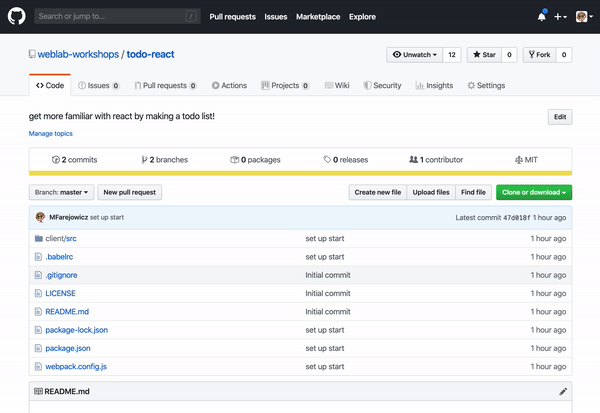

On the GitHub page, copy the link to the repo by pressing this button, making sure it is set to "Clone with HTTPS"



In the terminal, use the `cd` command to navigate to the folder you want to have the repo. Then use the `git clone` command with the link you just copied after the command. All together, the command should look like:
```
git clone https://github.com/weblab-workshops/todo-react.git
```

Congrats! You successfully *cloned the repo*.